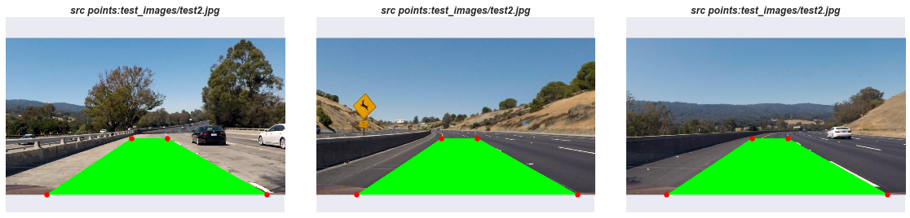
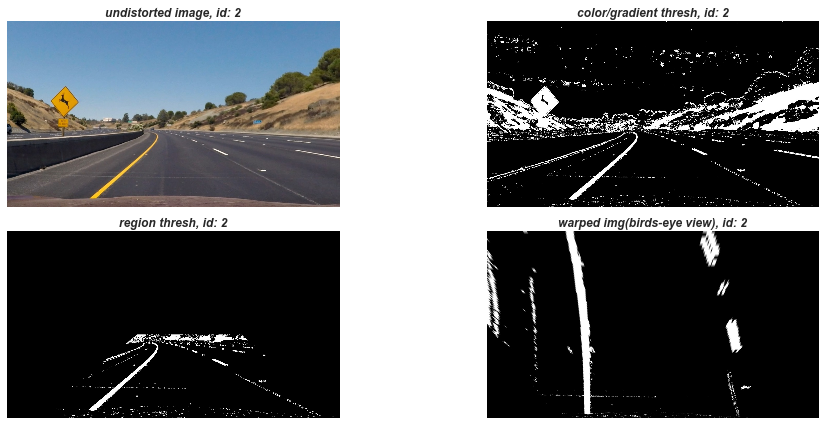
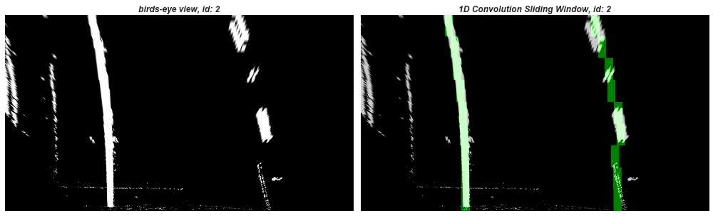

## Advanced Lane Finding
[](http://www.udacity.com/drive)

Goal: build a software pipeline to identify the curved lane boundaries in processing frames of a video
Self-Driving cars need to know the appropriate steering angle to turn, utilizing aspects such as how much the lane is curving


### Associated Files
- cam_cal.py:  calculates camera calibration matrix and distortion coefficients
- cv_transf:   computer vision transformation processing via OpenCV
- pipeline.py: main file associated for execution of the pipeline
- lines.py:    responsible for tracking and performing 1D convolution method and radius line curvature
- lane_curves.ipynb: used primary for visualizations and exploration of the resulted pipeline
- camera_cal_corners/: camera calibration images of (9,6) chessboard
- ckpts/calibration.p: serialized camera calibration camera matrix and distortion coefficients
- test_images/: folder of given Udacity test images
- test_images_tracked/: pipeline output tracked test images (name and index matched from given test_images)
- output_images/: subplots of the pipeline produced from the jupyter notebook
- video/: video inputs and outputs {output file are marked with {input video}_tracked.mp4}

Output Videos via available via Youtube:
[Advanced Lane Line Detection and Curvature](https://youtu.be/xeb7VkT3HwY)


### Execution
```python
# create/serialize camera calibration matrix and distortion coefficients (should be done first before pipeline execution)
python cam_cal.py
# start the pipeline for processing test images
python pipeline.py
# start the pipeline for processing frames from the project video
python pipeline.py -v
```

### Pipeline
1. Camera Calibration
2. Correct Distortion of frame from Camera Calibration
3. Produce Gradient and Color Space Binary Edge Features
4. Isolate the Region of Interest via masking an area  
5. Perform a Perspective Transform for a birds-eye view warped image
6. Determine which pixels belong to which lane lines (via 1D Convolution method)
7. Determine the Radius Curvature and Vehicle Center Offset and Annotate on the Image/Frame

```
Via execution of pipeline.py file, as noted above:
Reference for Test Images:  (file: pipeline.py, function: pipeline_images)
Reference for Video:        (file: pipeline.py: function: pipeline_playvideo)
```

#### Camera Calibration
- Calibration Camera will produce the camera matrix and distortion coefficients used in rest of the pipeline
    - Based on a the number of corners for a known shape (chessboard): (nx=9, ny=6)
    - Typically need >= 20 images to get a reliable calibration (which is what we have)


#### Distortion Correction
- Apply distortion correction to the current frame for processing based on calibration
    - Based on chessboard corner pattern, we can use it to correct the distortion in our `test images` and frames
    - Based on the transformation of a distorted image in 2D(image points) to undistorted in 3D (object points)

#### Gradient
The Gradient via the Sobel Operator(derivative in x,y direction) was calculated to provide an edge detected binary image.
In the following subplots, you will see a variety of different methods that were explored.  The *magnitude* and *combination*
methods seem to produce the best methods to produce sharper edges of the lane lines.  The pipeline ended up including a
combination of `(x,y) orientations, magnitude, and direction`.  As our lanes lines are close to vertical, taking the gradient
in the x-orientation plays a central role to detect steep edges.    

Reference: (file: pipeline.py, function: fetch_gradients)


#### Color Spaces
Rather than a binary frame based solely on gray scale, we can threshold different color channels for edge features.
Instead of using the traditional `RGB` color space, channels from `HSV` and `HLS` were used, take advantage of
varying light conditions or lanes of different color.  The *S Channel* from HLS, and *V Channel* from HSV were
thresholded.  The H,S channels should stay fairly consistent in shadows under different lighting conditions.
In addition, the *L channel* from LUV and *B Channel* from LAB were used, for conditions where the S and V
channel did not suffice.

Reference: (file: pipeline.py, function: combine_color_threshold)


#### Combining Gradient and Color Thresholds
From the prior steps, we can combine the Gradient and Color Channels to produce a masked binary image, based on
each pixel.  This binary masked image will be used to as input for a perspective transform.

Reference: (file: pipeline.py, function: pipeline_gradient_color)


#### Region of Interest
Rather than include all the pixels before perspective mapping, only the relevant pixels were included.
Reference: (file: pipeline.py, function: pipeline_roi)


#### Perspective Mapping
A birds-eye view warped image is produced via a perspective transform between a mapping of source and destination
points, via transforming the *z coordinate* by zooming in on further away parts of the image with a flat z-axis(0).
This will allow a 2nd degree Polynomial to be eventually fitted to each of the lanes lines (left, right), which
are near vertical for lane curvature.

Final Source and Destination Point Mapping Coordinates:

| Source        | Destination   |
|:-------------:|:-------------:|
| 575, 460      | 320, 0        |
| 185, 720      | 320, 720      |
| 1200, 720     | 960, 720      |
| 740, 460      | 960, 0        |







#### Finding Lane Lines
Determining which pixels belong to which line boundaries based on the warped image is done by a **sliding window 1D convolution** method.
Window Configuration: 9 Windows (Image Height: 720 pixels, Window Height: 80 px) moving vertically from bottom of image.

Rather than performing histogram peaks to find the initial left and right lane positions, a 1D convolution is performed.
The base center position of each line is found via the bottom quarter of the image from left to right (splitting the image in half).
A 1D convolution is performed to then find the peak centroids on the left half and right half of the image as baseline for each left/right line.
Using these baselines positions as a reference, the window can now be iteratively processed vertically to find the subsequent centroids for each line.

Reference LineConv1D class (file: lines.py, notable functions: find_window_centroids, draw_window_centroids)



#### Measure Lane Curvature and Vehicle Center Offset
Now that the window centroids for each lane(left, right) have been determined, the lane curvature and vehicle center offset can be calculated.
The lane curvature is determined via fitting a `2nd order polynomial` to each of the lane centroids previously calculated:

```
Note that this is for f(y) rather than f(x) since the lane lines are near vertical
lane = (left, right)
f(lane, y) = A(lane)*y**2 + B(lane)*y + C(lane)
A = curvature
B = heading/direction  
C = position from coordinates (0,0)
```

The Radius Curvature (reported in meters(m)) for each lane is calculated from these lane coefficients.  Below shows the formula for calculating
the curvature in pixels, however these are scaled from pixels to meters, as the real world is represented in feet or meters, not pixels.  An
averaged radius curvature is reported between the two lines as well.

```
With the y value representing the position closest to the car (hence the height of the image)
lane = (left, right)
R(lane, y) = ( (1 + ((2*A*y) + B)**2)**1.5) / |2*A|
R(y) = (R(left, y) + R(right, y))/2

Meters/Pixel Ratio (based on birds-eye view perspective transformation):
US Regulations require minimums of (x: 3.7m, y: 3m)
x: 4/600:  4 meters equivalent to 600 pixel in x direction  
y: 10/720: 10 meters equivalent to 720 pixels (height of our image)
```

The vehicle offset is calculated from the center of the left and right lane in meters


Reference: LineCurvature class (file: lines.py) for implementation of curvature

```python
# from function pipeline_frame() in pipeline.py
# annotate_frame calculates the curvature, vehicle center offset and annotates on frame
left_fitx, right_fitx = curvature.fit_lane_boundaries(window_centroids)
left_lane, right_lane, inner_lane = curvature.fit_lanes(left_fitx, right_fitx)
img_lanes = curvature.view_lanes(undist_img, Minv, left_lane, right_lane, inner_lane)
img_annot = curvature.annotate_frame(img_lanes, window_centroids, left_fitx, right_fitx)
```

### Discuss Points
While processing frames, there may be some frames that fall outside of the respective margin and do not line up
well with curvature and then steering angle recommendations.
- For example what happens if the warped image transformation lines are not parallel or fail to detect due to
severe shadowing or lighting conditions, not accounted for in color space features.  In this case, rather than
static thresholding, prior knowledge about previous frames and relaxing the current thresholds could be performed,
possibly replacing or adjusting the current values.
- If several frames start to fail in a sequence, it could beneficial to have a fall back mechanism, such as
reverting back to the histogram sliding window approach.  
- As the frame processing continues, there may some frames that are detecting a more severe curvature than other
frames.  In a way this can be considered an anomaly, but it needs to be accounted for so a proper steering
action can be taken, and the frame is just not dropped.
- It could also be handy to have a confidence metric in case the identified pixels fall outside of a margin
