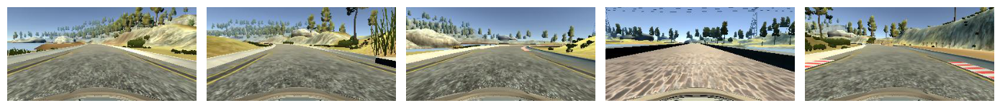
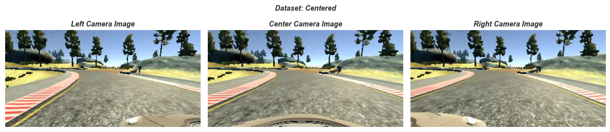
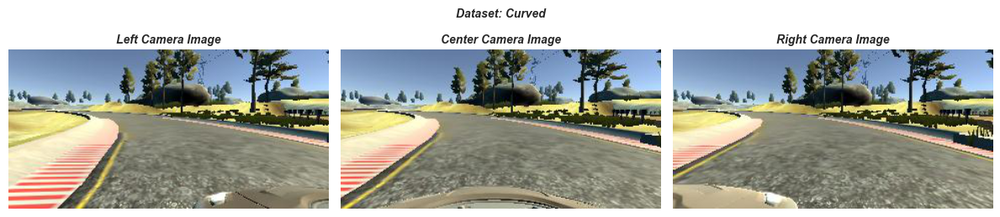
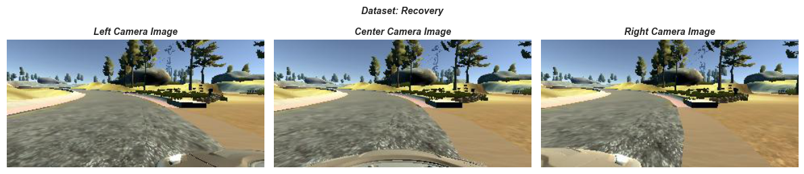
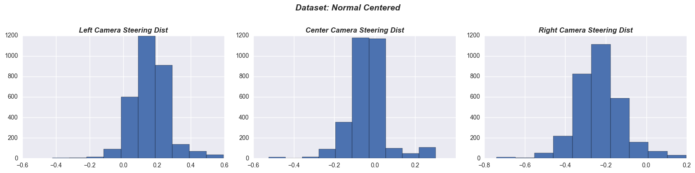
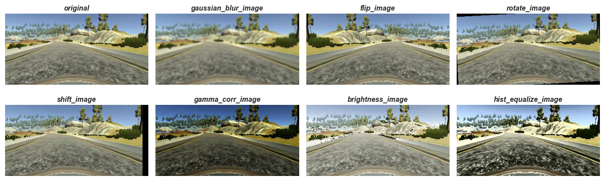
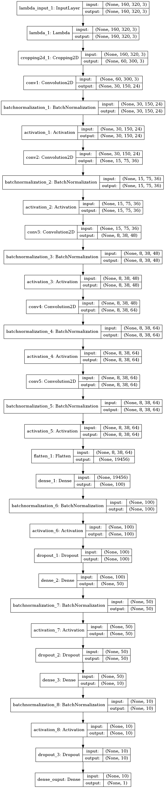

## Behavioral Cloning Project

[](http://www.udacity.com/drive)

- Behavioral Cloning: Training an AI agent to emulate human driving behavior
- Primary Goal: Build a end-to-end CNN model in Keras that predicts steering angles from images
- Objective: Navigate correctly on Simulation Track (Track 1, Track 2) to center the car
- Prediction Output: Regression via Vehicle Steering Angle from center camera
- Training Data: Collect via Simulator (Tracks 1 + Track 2), compare w/Udacity data as baseline
- Evaluation: Test model successfully drives around track one without driving off the road
- Video Output: [Behavioral Cloning Autonomous Mode](https://youtu.be/FU2FS6RXJL8)

### Image Examples






*Steering distribution plots are captured before additional data augmentation*




### Deliverable Files
- model.py:     	defined model architecture
- drive.py:     	udacity provided file for executing simulator in autonomous mode of track
- video.py          udacity provided file for creating a video from capture autonomous driving
- train.py:         algorithm implementation for training via keras generator
- nn_utils.py:  	general utilities to for preprocessing
- data_utils.py: 	utilities for dataset specific preparation
- data_augment.py: 	data augmentation utilities and serializes the data to disk
- cv_transf.py:     computer vision utility functions, primarily for augmentation
- ckpts/model.h5:   produced model weights and architecture
- data/udacity/: 	(not uploaded) udacity specific training + augmented data
- data/train/: 		(not uploaded) training simualator + augmented data
- behavioral_cloning.ipynb: notebook for visualizations

#### Library Dependencies:
- Visualization Dependencies: pydot, graphviz, matplotlib, seaborn
- Additional Dependencies: cv2, keras, sklearn
- Typical Libraries: numpy, pandas, pickle, ...

### Execution
```sh
# perform initial augmentation to serialize to disk
python data_augment.py
# create and train the model
python model.py
# execute model within context of Udacity simulator for 'autonomous mode'
python drive.py ckpts/model.h5
```

### Training Data
#### Simulator Collected Data
Generated Simulator data: {data_path}/driving_log.csv file is created w/following pertinent information:
- Image File Names: (left, center, right camera images)
- Normalized Steering Angle ([-1.0,1.0]) radians for center image
- Data was gathered for both Tracks: Track 1 + Track 2 (reference distributions below)
- Gather 3 sets of data and combine: centered, recovery, along curves (reference distributions below)

```
Track1: Center: 3066, Curves: 3256, Recover: 1417, Total: 7739
Track2: Center: 4645, Curves: 2108, Recover: 1094, Total: 7847
Num Overall Samples: 29757
Number Train Observations: 23805, Validation Observations: 5952
```

#### Training Methodology
- Split Train and Validation dataset (70/30), rather than use Keras due to lack of shuffle in partition
- Data Partitions are randomly shuffled before batch generation
- Training data are names of files, not the images themselves fit into a batch generator
- Instead the names of the files were fit via batch size, and loaded into memory during the batch generator
- Recovery: For the model to learn and adapt, data was gathered in different positions, along w/centered data.

  ```
  Data augmentation, and Left, Right cameras were used w/adjusted steering angle toward center
  For curves/recovery data, a more severe steering angle adjustment was made (only Left, Right cameras)
  Curve and Recovery data was added only to the Training dataset, not the validation dataset
  In the real world, a recover path from each camera would be performed, in this case we are simulating it
  ```
- Only Training data will be augmented, not validation data
- There were some images that snuck in as 4 dimensions, rather than 3 Dimensions (RGB), these were dropped in the batch generator

#### Augmentation
Augmented Training Data to recover from a poor position or orientation:
- Augmented Images format: denoted by the according format: `{camera_direction}_{timetamp}_{augment_type}_augmentation.jpg`
- Using Left, Right Camera Images, with an steering offset +- random uniform between [0.10,0.30], for recovery [0.35,0.50].

  ```
  For left image: add positive adjustment; right image: add negative adjustment to move towards center
  Multiple Cameras (L,R,C) for recovery from being off-center, mapping recovering paths from each
  If using Left  Camera Image: associate w/softer left turn
  If using Right Camera Image: associate w/harder left turn
  ```
- Flip Images along *vertical* axis, inverting given steering angle. to neutralize tendencies of driver.
- Small artificial rotations of the image random uniformly distributed between [2.5,10] degrees
- Translation: shift of pixels random uniformly in both lateral and vertical positions (simulate elevation)
- Add a Gaussian blur to the image: kernel size randomly selected [3,5,7]
- Apply Gamma correction to control brightness, particularly for night conditions: [0.25,0.6]
- Random color adjustment via brightness in L channel of HLS color space: [0.25,0.5] multiplicative factor
- Histogram Equalization as another method to adjust Contrast of image

### Model Architecture
- Convolutional Layers: Feature Extraction, FC layers: Function as a controller for steering
- Preprocessing (Normalization, ROI) done within within model, to take advantage of GPU and adapt to any image size
- Data augmentation is done outside the model
- Final Model Architecture Diagram:


#### Methodology
- The Training/Validation Accuracy/Loss was not a good metric to assess the model
    - Rather a serialized model needed to be evaluated on the simulator in autonomous mode.
    - Given enough data, it is possible, this metric could have been more heavily used.
- Therefore no *learning curve* analysis was used, as in addition few epochs were used (as no improvement occurred)

  ```
  Overfit:  low MSE on train,  high MSE on validation (more data, augment, dropout, pooling, fewer layers)
  Underfit: high MSE on train, high MSE on validation (more epochs, add more convolutions)
  ```
- Start with a baseline based on Udacity data (+ Training Augmentation):

  ```
  Baseline Udacity Augmented data Results (Batch Size=64, Learning Rate=1e-3)
  Similar to Comma.ai: Did not complete Track 1
  Similar to Nvidia:   Completed Track 1
  Custom model derived from Nvidia:  Completed Track 1
  ```
- Custom data via Simulator (Track1 + Track2 + Curves + Recovery + Training Augmentation):

  ```
  Similar to Nvidia:   Completed Track 1, 2 (track 2 for low graphics quality)
  Custom model derived from Nvidia:  Completed Track 1,2 (track 2 for low graphics quality)
  ```

  ```
  The custom model added in Batch Normalization + Dropout in the Dense Layers
  Comparison between different activation functions: ReLU/ELU/Leaky ReLU
  Applying ELU Nvidia model alone did not lend itself to good results: did not complete track 1
  In the end ReLU was used on the custom model  
  ```

#### Model Pre-processing
The following are done within the model architecture to take advantage of the GPU for processing
- Normalize Images to within [-1,1] scale
- Crop Top and Bottom of Images to focus on ROI: (Top=75,Bottom=25), (Left=10,Right=10)

  ```
  Original Image Dimensions:  (160,320,3)
  Cropped  Image Dimensions:  (60, 300,3)
  ```

#### Configuration/Hyperparameter Tuning
- Optimizer: Adam
- Loss Metric: Mean Squared Error (MSE) (as a regression problem)
- Learning Rate Initialization: 1e-3
- Batch Size: 128 (powers of 2)
- Number of Epochs: 10 (small number of epochs was used than typical)
- Regularization: Dropout (0.2, as Batch Normalization acts as a regularizer in a manner)

#### Overfitting and Optimization Techniques
- Scale Data via Lambda Layer, Cropping out part of image for ROI
- Weight Initialization
- Data Augmentation
- Batch Normalization
- Regularization (Dropout)
- Data Training/Validation split: Simulator serves as test data
- Early Stopping (via callbacks in Keras fit generator via patience of 5 epochs)
- Generalize to multiple tracks (Track 1 + Track 2 Data Collection)

#### Additional Future Actions
- Generalizing to different datasets
- Additional Augmentation techniques to help with shadows
- Possibly drop out smaller steering angle variations, as they will not have much effect
- Transfer Learning Architectures (started implementation): VGG16, VGG19, Resnet50, InceptionV3

### References
- [Nvidia End-to-End Learning for Self Driving Cars]
(http://images.nvidia.com/content/tegra/automotive/images/2016/solutions/pdf/end-to-end-dl-using-px.pdf)
- [Comma.ai Model Reference]
(https://github.com/commaai/research/blob/master/train_steering_model.py)
- [Keras Augmentation Reference]
(https://blog.keras.io/building-powerful-image-classification-models-using-very-little-data.html)
