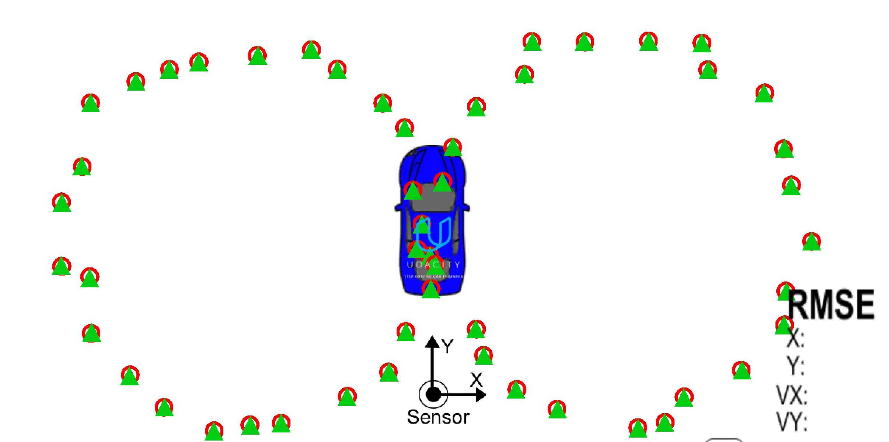
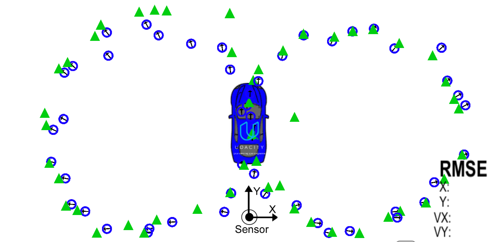
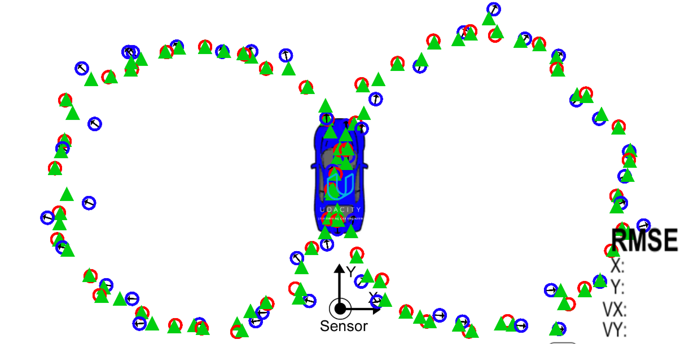

## Extended Kalman Filter
[](http://www.udacity.com/drive)

- Category: Sensor Fusion via (Lidar + Radar)
- Goal: Track a pedestrian bicycle object that travels around the vehicle
- Simulator: plot measurements, estimations as simulated vehicle drives in fixed configuration of *figure eight pattern*


### Simulator Captured Images
*Lidar Only:*

*Radar Only:*

*Sensor Fusion of Lidar + Radar:*


### Functionality
- Initialization: Initialization of matrices and first measurements
- Predict: calculate new x and P after sampled time(dt) (determine where object will be after time step)
- Update (Lidar): using incoming readings and measurement transition matrix to calculate new x and P
- UpdateEKF (Radar): use linear approximation of readings via Jacobian Matrix to calculate new x and P
- Performance: calculate RMSE comparing Kalman Filtered Results and provided Ground Truth

### Notable Files
The main files modified were: tools.cpp, FusionEKF.cpp, kalman_filter.cpp
- kalman_tracker.py: 2D Unity visualization tool to communicate between simulator and *ExtendedKF* program
- src/tools.cpp: implements RMSE and Jacobian matrix
- src/main.cpp: reads in data, executes Kalman Filter, envokes calculation of RMSE
- src/FusionEKF.cpp: initializes filter, predicts, updates
- src/kalman_filter.cpp: defines predict function, update function for lidar, update function for radar (EKF)

### Data
- data/
    - obj_pose-laser-radar-synthetic-input.txt: Udacity provided lidar & radar sample data
    - lidar/{data_in.txt, data_out.txt}: collected lidar data from simulator
    - radar/{data_in.txt, data_out.txt}: collected radar data from simulator
    - lidar_radar/{data_in.txt, data_out.txt}: collected lidar & radar data from simulator
- logs/
    - output_udacity_data.txt: based on using udacity sample (obj_pose...) as input
    - output_simulator_lidar_radar.txt: based on using simulator extracted data as input
- Select Field Descriptions:
    - sensor_type: {L: lidar data, R: radar data}
    - yaw, yawrate: only for unscented kalman filter (UKF)
    - radar measurments:   {rho_measured, phi_measured, rhodot_measured}
    - lidar measurements:  {x_measured, y_measured}

### Build
1. Make a build directory: `mkdir build && cd build`
2. Compile: `cmake .. && make`
3. Clean and Compile: `make clean && make`

### Usage
For Visualization from Simulator:
- first launch simulator (e.g. kalman_tracker_mac)
- execute `kalman-tracker.py` with path to `ExtendedKF` binary

```sh
# from <root of repository>
python kalman-tracker.py build/ExtendedKF
```

```sh
# from within directory:  <repository>/build/

# for Udacity sample data
./ExtendedKF ../data/obj_pose-laser-radar-synthetic-input.txt  ../logs/output_udacity_data.txt
# for collected simulator lidar and radar data
./ExtendedKF ../data/lidar_radar/data_in.txt  ../logs/output_simulator_lidar_radar.txt
```


### Resources
- [repository](https://github.com/udacity/CarND-Extended-Kalman-Filter-Project)
- [sensor fusion utilites](https://github.com/udacity/CarND-Mercedes-SF-Utilities)
- [Google Style Guide](https://google.github.io/styleguide/cppguide.html)
