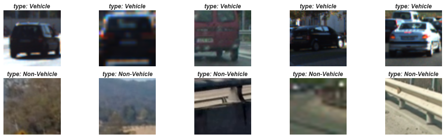
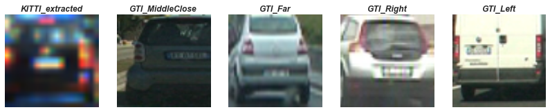
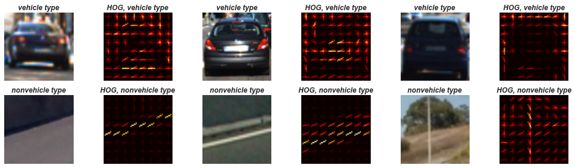
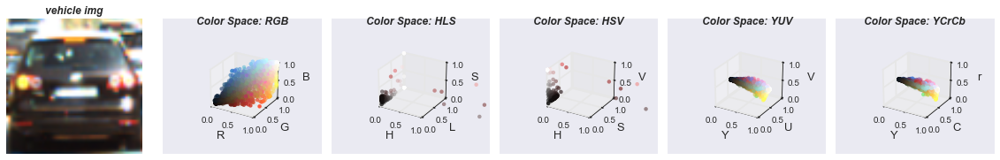
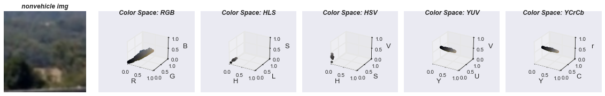
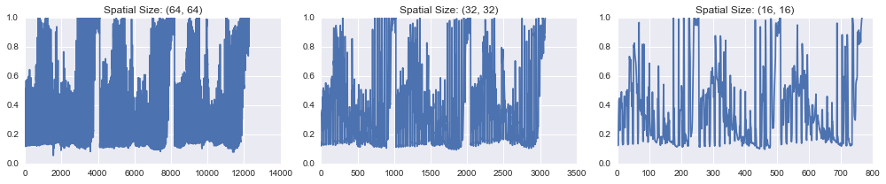
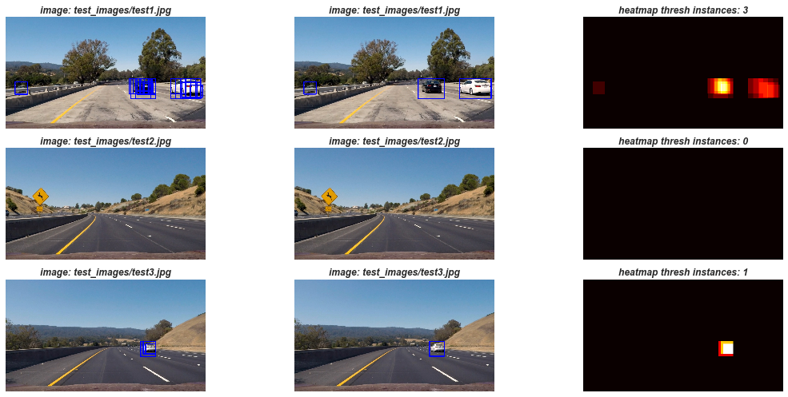
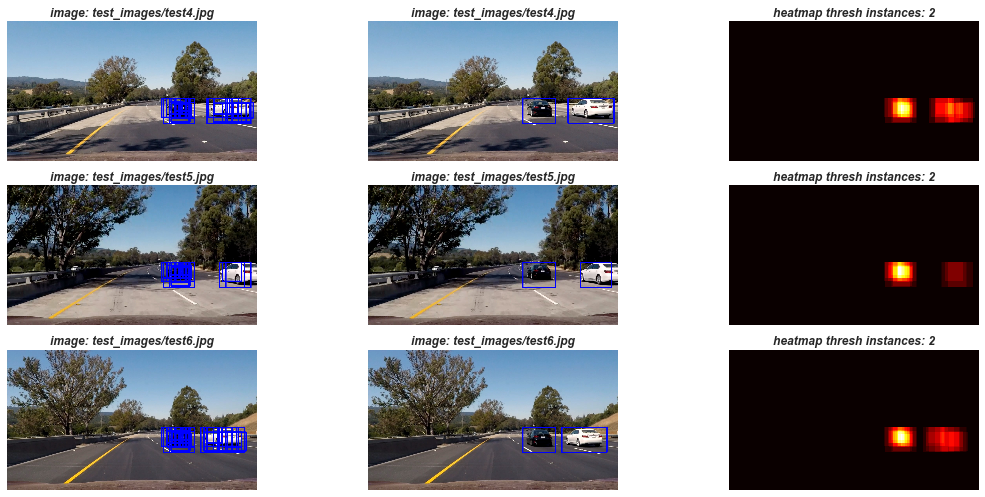

## Vehicle Detection
[](http://www.udacity.com/drive)

- Category: Object Detection
- Training Method: Classifier + Sliding Window to search vehicles in images
- Execution: Pipeline on video stream (after test images initially used)
- Goal: Estimate a *Tight Bounding Box* for positively detected vehicles, avoiding False Positives
- Reduce False Positives: Heat map of recurring detections to reject outliers

### Pipeline
- Extract Visual Features for detection purposes for classification  
- Spatial Binning for Downsampling Frame of Color Space Features
- Combine Structural Features (Gradients(HOG) and Normalized Downsampled Color Spaces Features
- Combining Features: Normalize Concatenated Features
- Search an Image for Detection via Sliding Window Technique
- Track Detections frame-to-frame, rejecting noisy detections (False Positives)
- Estimate bounding box for positive vehicle instances detected (on video, where the video acts as a test set)

### Datasets
- Video Data Sources:
    - test_video.mp4 (initial test data source)
    - project_video.mp4 (pipeline execution video test case)
- Image Data Sources:
    - [Labeled Vehicles: 64x64](https://s3.amazonaws.com/udacity-sdc/Vehicle_Tracking/vehicles.zip)
    - [Labeled Non-Vehicles: 64x64](https://s3.amazonaws.com/udacity-sdc/Vehicle_Tracking/non-vehicles.zip)
    - [KTTI Vision Benchmark Suite](http://www.cvlibs.net/datasets/kitti/)
    - [GTI Vehicle Image Database](http://www.gti.ssr.upm.es/data/Vehicle_database.html)
    - [Udacity Annotated](https://github.com/udacity/self-driving-car/tree/master/annotations)
    - Test Images: /test_images, Videos: /videos

### Files
- cv_features.py: feature extraction operations   
- cv_utils.py: general computer vision utilities  
- cv_windows.py: sliding window operations
- data_utils.py: data utilities for working with vehicle/non-vehicle datasets
- viz_utils.py: visualization utilities and transforms
- f2f.py: Track frame-to-frame tracking and processing w/heatmap
- search.py: Sub-Sample Hog Feature coordinates based on predictions of classifier
- model.py: classifier model configuration, training, and tuning
- pipeline.py: main file for execution (similar to jupyter notebook)
- vehicle_detection.ipynb: jupyter notebook for visual explorations


Output:
- output_images/ : images from the pipeline execution of 'test_images/'
- videos/: [Project Video via Youtube](https://youtu.be/y2TBHgbbudU)


### Execution
```
# also available via jupyter notebook for test images
# note that the training and tuning takes a long time due to SVC Linear Classifier w/probabilities, dependent on the feature configuration

# train/tune model on images
python -t pipeline.py
# video frame inference (model must be trained first on test images)
python -v  pipeline.py
```


### Vehicle vs Non-Vehicle Exploration
```
Num Vehicle Images: 8792
Num Non-Vehicle Images: 8968
Image Dimensions: 64x64
Vehicle Data Source Counts:
{'GTI_MiddleClose': 419, 'KITTI_extracted': 5966, 'GTI_Left': 909, 'GTI_Right': 664, 'GTI_Far': 834}
Non-Vehicle Data Source Counts:
{'GTI': 3900, 'Extras': 5068}
```



Examples of the different Data Sources for Vehicles:


### Feature Exploration/Tuning
The following feature extractions were utilized for classification of vehicle vs non-vehicle:
These are the concatenated handcrafted features that will be used via our classification model per image.
- Color only: Histogram of Pixel Intensity
- Spatial Binning: Effects of downsampling the image
- Structural Shape: Histogram of Oriented Gradients (HOG)

Reference: (file: cv_features.py, functions: extract_features, fetch_features)

#### Color Space
Used Color Space instead of Template Matching technique due to objects that vary in motion per frame, that have
different orientation and sizes.  The color histogram distribution is more robust to changes in appearance,
removing dependence on structure.  Some initial exploration was performed via:
Reference: (file: cv_features.py, function: color_histogram, transform_colorspace)
- Color Invariance: Via other color spaces (cylindrical coordinates), RGB, YUV

- 3D Space between Vehicle vs Non-Vehicle samples (``YCrCb`` could be a good differentiator)



#### Spatial Binning
An unrolled 1D Feature vector of the original image is quite large, so Spatial binning via downsampling
a transformed color space was used in order to determine the minimum number of spatial dimensions
required to be useful.  The selected dimension was ``16x16`` from ``64x64``.

Reference: (file: cv_features.py, function: bin_spatial)


#### Histogram of Oriented Gradients (HOG)
HOG provides a method to detect structural shape signature via gradient magnitude direction.  The dominant
gradient direction per channel within each cell (brightness corresponding to strength of gradients) is
detected while allowing for small variation in shape to keep signature distinct enough.  Notice the difference
between the HOG images from those that represent the structure of a Vehicle.

Reference: (file: cv_features.py, function: get_hog_features)


### Partition Split/Preparation of Data
Reference(file: model.py, functions: partition_data_basic, scale_data)
- Features Extracted separately for vehicle and non-vehicle for corresponding target
- Features are then shuffled while maintaining the target
- Train/Validation Split of 80/20 is performed
- Features are transformed based on fitting the training data and scaling the validation based on training transform.
This is better practice than fitting all of the data and then scaling each partition.
- Note that the training data could have been augmented w/Udacity training data for more data, although this
requires manually cutting out the instances of vehicle vs non-vehicle to be used for classification.

An alternative training/validation was explored where the training data would receive all of the KITTI vehicle samples,
and the remaining GTI vehicles would be split across the training and validation splits.  Note that this requires to
first partition and then then extract features.  This method did not generalize well during prediction, as it adds
in *selection bias*, therefore a randomized partition was reverted to instead.

### Classifier
Classification was performed in two manners:
- Evaluation of Configurations for Feature Extraction: Linear SVM
- Training Sequence: SVM w/Linear Kernel that allows for **probability** estimates
Alternatively an ensemble classifier could have been used as well.

### Final Tuning Configuration for Feature Extraction
Evaluation of parameters performed via default configuration of LinearSVC via K-Fold Cross Validation (with 5 Folds),
on 30% of the overall sample data.  There was a specific ordering maintained, where a parameter was tuned via K-Fold CV
and the configuration was adjusted for the next parameter tuning.  The items marked with #tuned were modified for
more optimal performing settings.

```
 Reference (file: model.py, function: fine_tune_features)
 'cells_per_block': 2,
 'color_space': 'YCrCb',
 'hist_bins': 32,                #tuned: 48
 'hog_channel': 'ALL',
 'log': False,
 'orient': 9,                    #tuned: 8
 'pix_per_cell': 8,
 'spatial_size': (32, 32)        #tuned: (16,16)

 Reference (file: pipeline.py, function: main function)
 'ys': [400,656],
 'xs': [200, None],
 'cells_per_step': 2,
 'window': 64
 'scales': [1.0, 1.5, 1.75, 2.0]    # provides windows of (64,80,96,128)
```

### Sliding Windows
Rather than extracting features for each particular image as input to the classifier, a more efficient method
is to extract the features once (per our training and validation partitions) and subsample to get overlaying windows.
In a traditional sliding window method, a grid pattern splitting the image region to be searched over would be performed.  
Reference: (file: search.py, functions: config_hog_search, subsample_hog_features)
- Restrictive Search was used to help reduce search time and reduce areas of an image to search over, with the following coordinates:
``('ys': [400,656], 'xs': [200, None])``
- Rather than a single window size, multi-scale windows were used and overlapping windows were combined, via thresholding the
heatmap coordinates and combining areas in a windows of non-zero pixels.  The multiple scales helps detect varying object shape size
instances.  The downside is that the training time increases, so we need to keep the number of windows to search over still relatively reasonable.  The restrictive search area, does help in reducing the number of windows to search over.  The windows were chosen
to be a multiple size of the base window (e.g. 64,80,96,128).
Reference(file: pipeline.py, function: pipeline_process_frame)

#### Rejecting False Positives
Reference( file: f2f.py, process_frame)
- In order to avoid false detections, a smoothing operation of the heatmap was performed where we look at a temporal window of frames
for a video sequence and keep a moving average of these heatmap pixels.  Based on this moving average windows size(20), we
determine how to draw the bounding boxes.  This ensures the same vehicle should be detected in subsequent frames within
the window, else we would get more false positives of vehicles.
- Although I didn't find thresholding the heatmap for the number of labeled instances worked quite well, so I used a probability
estimate from the classifier.  So instead of just detecting a positive vehicle instance, I only kept track of coordinates where
we had a high confidence in the detection (e.g. 95%).  This method seemed to work better.  Essentially it operates as another
decision boundary, much like modifying the classification boundary in an ROC Curve.




#### Discussion Points
As noted above, the following optimizations could have been performed:
- Augmentation of Training data w/annotated samples
- Originally I thought the feature extraction method via performing a K-Fold CV based on optimal ROC score would have
helped in the classification, however this was not the case, and resulting in some false positives.  Therefore a few of
the parameters were modified in the final feature extraction (hist_bins, orientation, num_bins).  As well the K-Fold CV
takes a long time to evaluate, however this is only used during the training and evaluation phase, not on the
inference of the video frames.
- Other methods for rejecting false positives via a different classifier (ensemble), as well as improved methods
over probability based estimates and thresholding.  As noting the thresholding does not seem to work well with a static number,
for example it is possible a bounding box can fit just correctly, and if we require a minimum number of boxes, we could zero
this out and not include it in the positive instance.  However the SVM Classifier takes a long time to even perform inference
on, and we opted for this version of the SVM for its probability based estimates.
- Tuning the Classifier of hyperparameters for a better max margin, however note that the SVM classifier already takes
a long time to train.
